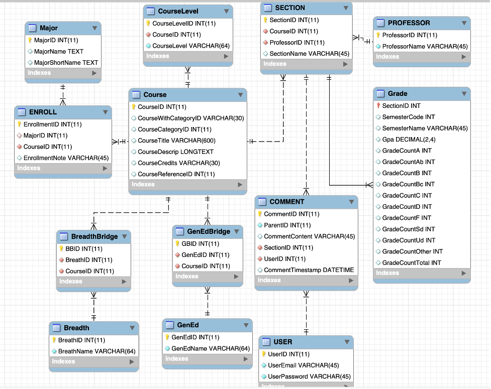

# Malaxy
## Project Abstract
In this project, we want to design a website that would help students do their course selection, which would save the students a lot of research time, providing them with an integrated platform with plenty of information about other students’ comments, course content, grade distribution, etc.
## Document Revision History
- Rev. 1.0 <2022-10-12>: initial version
- Rev. 1.1 <2022-11-17>: update database schema, rework user interface, add course filters to search feature, fix typos
- Rev. 1.2 <2022-12-14>: update user interface, update use cases

## Customer
Undergraduate and graduate college students are the primary stakeholders. At the same time, the customer base can be extended to any group of students who need to choose courses (including high school students, for example). Initially, we will specifically target students at the University of Wisconsin-Madison who want accurate, extensive, and comprehensive information. Everything they need to determine the best possible course depending on their requirements, will be provided in a single space. We did random surveys in Union South and discovered that students are interested in browsing the website to see how they are doing through the course evaluation and how they can potentially move forward.

Other customers include teachers, teaching assistants, and course designers. During the same survey in union south, we discovered instructors are also interested in getting feedback on their classes as it will be restriction-free, in a space where students can provide genuine evaluations on classes and professors without fear of recourse. They can then use the feedback from students evaluating the course, where the teaching team can improve their teaching style, content, curriculum, etc. 
UW-Madison's Registrar's Office will provide a course database for us.

## Competitive Landscape
While there are many websites that provide information to help with course selection, they are sometimes not up-to-date or not representative, and they are often on different websites, requiring students to go to many pages on each site to get comprehensive information about a class. 

References to similar systems are madgrades and RateMyProfessor. However, unlike Madgrades and RateMyProfessor, Mad Course Evaluator gives a space for users to not only leave comments but also communicate on follow-up questions as well. Besides, RateMyProfessor aims at rating professors, which give limited help on whether the course is designed well or other course based information. Additional reference is to Amazon. The comment area in Amazon gives lots of hints to us as it allows users to rate a product, leave questions, and wait for them to be answered.

## Competitors Analysis
- Madgrades (https://madgrades.com/)
- Rate My Professors (https://www.ratemyprofessors.com/school?sid=18418)
- UW-Madison Grade Distribution Search (http://wisc.alext.se/)
    - Similarities:
      - search for a course
      - overview of the grade distribution over different semesters
    - Identified strengths:
      - allow interactions between users
      - karma system ensures the quality of discussion board
      - class comparison
      - shopping cart
      
## Our Strengths 
- discussion board, users can share their opinions or ask questions about one course/instructor, we provide a community for students to communicate

## What can we learn from their implementation?
- Madgrades does a good job on visualizing the grade distribution and users are able to export the statistics. Besides, Madgrades allows users to explore courses instead of only searching for a specific course. 
- RateMyProfessor allows users to report ratings. This feature is pretty important since some ratings could be extremely toxic or biased.
- UW-Madison Grade Distribution Search allows users to search for a department and would display all courses provided by that department

## What product features can create competitive differentiators?
- Madgrades, RateMyProfessor, and UW-Madison Grade Distribution Search do not exhibit too many details about the course/professor. However, it is highly likely students want to know more about the course structure or how a professor organizes the course. Therefore, our discussion board features can provide students with that information; students can easily post questions/express concerns about courses. One thing we need to think about is how to encourage users to discuss.
- Furthermore, our class comparison page allows users to compare courses so they can figure out the advantages/disadvantages of each course then make the final decision.
- Last but not least, our shopping cart feature allows users to add their favorite courses to a shopping cart, then they can access these courses from the shopping cart at a later point. Therefore, they do not need to go back to the main page and search for courses again.

## User Interface Requirements
### Page Structure
1. Front Page (Visitor)
  - Search window
  - Course Info window
  - Sign up window
  - Log in window
    - Reset Password Page

2. Select Course Page

3. Main Page (Logged in User)
  - Search window
  -  Course Info Page
  - Profile Info Page
    - Change Password Page

## Screenshot
- ERD

- Visitor Page

- Log in Page

- Sign up Page

- Course List Page

- Course Info Page

